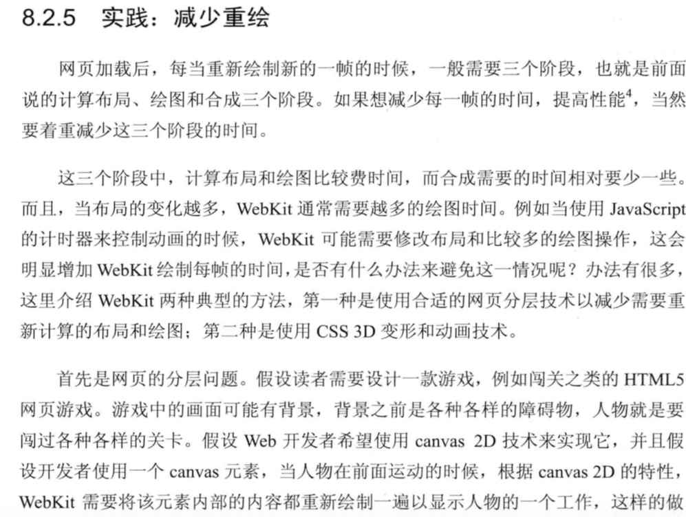
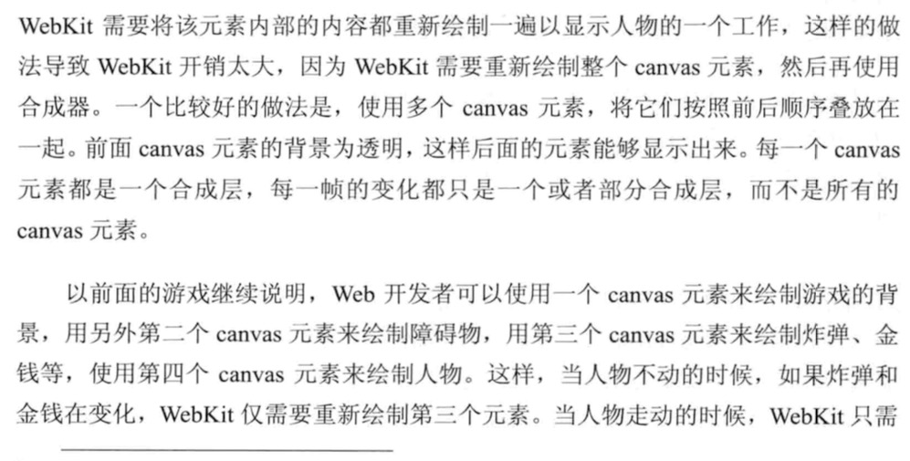
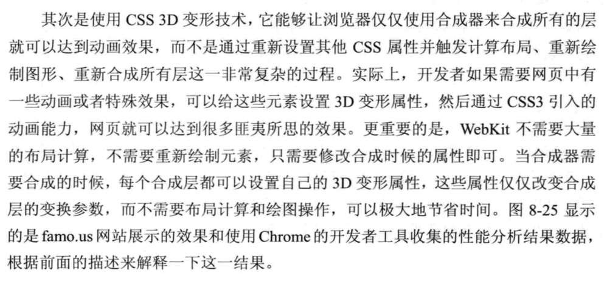
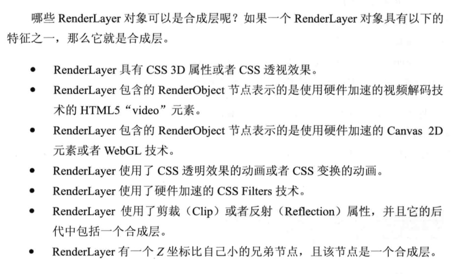
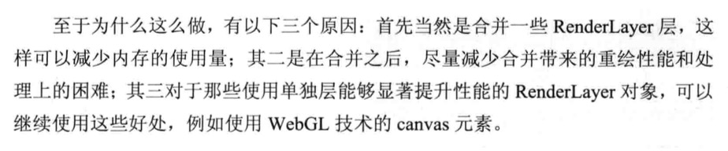
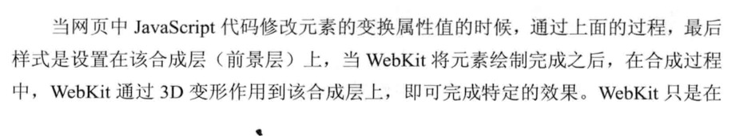
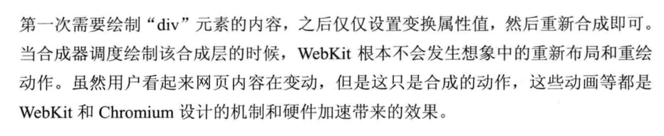

## 前端常见性能优化
### 合并http请求，减少http请求的数据量：合并css js文件，并且压缩。
### 使用缓存：客户端，cdn等。
### 媒体文件使用流媒体。
### 放弃传统操作dom，基于vue react来做开发。
### 分离读写操作（现代的浏览器有渲染队列的机制）
offsetTop.offsetLeft,offsetWidth,offsetHeight,clientTop,clientLeft,clientWidth,clientHeight,scrollTop,scrollLeft,scrollWidth,scrollHeight,getComputedStyle,这些相当于读取元素的位置信息，会刷新渲染队列。

```
div.style.top = "10px";
console.log(div.offsetWidth);  // 将读取的操作放在一起。不要跟写入操作混在一起
div.style.bottom = "10px";
div.style.right = "10px";
```
### 样式集中改变。

```
div.style.cssText='width:200px;height:200px;';   // 直接写在cssText中，不过一般很少使用
```


### 缓存布局信息。

```
let width = div.clientWidth;
let height = div.clientHeight;
div.style.width = width+10+'px';
div.style.height = height+10+'px';
```


### 元素批量修改。

```
let fragment = document.createDocumentFragment();   
for(let i = 0; i<1000;i++){
    const child =  document.createElement('div');
    fragment.appendChild(child);
}
div.appendChild(fragment); 
``` 
### 动画效果 应用到position属性为absolute或fixed的元素上：脱离文档流后回流会减少。
### css3硬件加速，使用transform opacity filter等，canvas WebGL等会开启硬件加速。
  
  
  
  
 
 
  
### 牺牲平滑度换取速度：每次一个像素的移动改为3个像素等。
### 避免table布局和使用css的javascript表达式。 