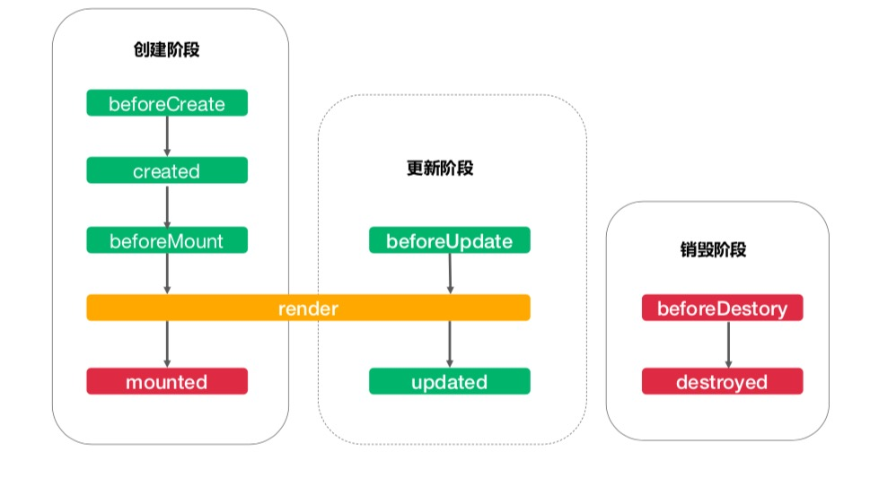

## 前言
本文主要讲解vue中的实例和生命周期、模版、计算属性、class绑定的重要概念及相关的demo代码。
## vue实例及生命周期
vue实例的创建方法：  

```
var vm = new Vue({
  // 选项
})
```
一个 Vue 应用由一个通过 new Vue 创建的根 Vue 实例，以及可选的嵌套的、可复用的组件树组成。每一个vue的组件都是一个vue的实例。  
每一个实例都有一系列的生命周期函数，也就是实例创建和运行的过程中各个时间节点上的钩子函数。
vue生命周期主要分为三个阶段：创建阶段，更新阶段和销毁阶段。
  
其中创建阶段的created 和mounted阶段一般用来请求和处理后端返回的数据。销毁阶段的beforeDestory阶段一般用来销毁资源，比如定时器的句柄等。
## 模版语法
Vue.js 使用了基于 HTML 的模板语法，允许开发者声明式地将 DOM 绑定至底层 Vue 实例的数据。所有 Vue.js 的模板都是合法的 HTML ，所以能被遵循规范的浏览器和 HTML 解析器解析。  
模版最终会被解析为js的对象来执行。vue除了支持模版外，还支持jsx的形式。  
模版中显示文本的写法：  

```
<span>Message: {{ msg }}</span>
```
如果想直接显示html代码，可以使用v-html指令，不过可能存在xss攻击，一般不建议使用。

```
<p>Using v-html directive: <span v-html="rawHtml"></span></p>
```
如果想绑定动态的数据，可以使用v-bind指令：

```
<div v-bind:id="dynamicId"></div>
```
vue中有一些列的指令来方便开发，带有 v- 前缀的特殊特性是指令。比如：v-if：

```
<p v-if="seen">现在你看到我了</p>
```
当seen为true时p标签会被渲染，为false的时候不会被渲染。  
v-on指令用来绑定处理函数：

```
<a v-on:click="doSomething">...</a>
```	
		

