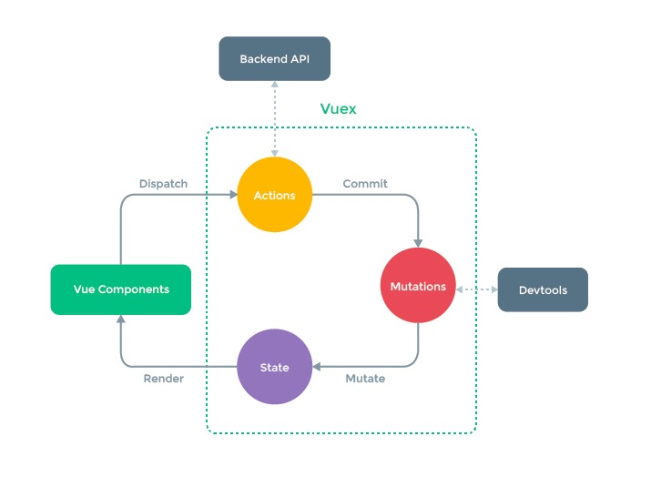

## vuex介绍
在现代前端开发中，组件之间的通信是一个很重要的知识，父子组件之间如何传递数据，兄弟组件之间如何传递数据以及如何跨层级进行传递数据都是很关键的问题。无论react还是vue，为了解决这些问题都提供了一些解决方案，其中vuex就是在vue中解决这些问题的一个优秀方案。  
Vuex 是一个专为 Vue.js 应用程序开发的状态管理模式。它采用集中式存储管理应用的所有组件的状态，并以相应的规则保证状态以一种可预测的方式发生变化。
## vuex核心概念
每一个 Vuex 应用的核心就是 store（仓库）。store从某种角度看就是一个全局对象。Vuex 和单纯的全局对象有以下两点不同： 
Vuex 的状态存储是响应式的。当 Vue 组件从 store 中读取状态的时候，若 store 中的状态发生变化，那么相应的组件也会相应地得到高效更新。  
你不能直接改变 store 中的状态。改变 store 中的状态的唯一途径就是显式地提交 (commit) mutation。这样使得我们可以方便地跟踪每一个状态的变化，从而让我们能够实现一些工具帮助我们更好地了解我们的应用。
 
创建store的方法：  

```
const store = new Vuex.Store({
  state: {
    count: 0
  },
  mutations: {
    increment (state) {
      state.count++
    }
  }
})
```
### State  
state就是vuex存储的变量的集合。我们可以通过state来获取存储在vuex中的变量。

```
console.log(store.state.count)
// 一般情况下会通过计算属性来返回
computed: {
    count () {
      return store.state.count
    }
}
```

### Getter
getter就是store的计算属性。  可以用来定义一些需要计算的

```
const store = new Vuex.Store({
  state: {
    todos: [
      { id: 1, text: '...', done: true },
      { id: 2, text: '...', done: false }
    ]
  },
  getters: {
    doneTodos: state => {
      return state.todos.filter(todo => todo.done)
    }
  }
})
```
访问getter ： 

```
store.getters.doneTodos
```
mapGetters 辅助函数仅仅是将 store 中的 getter 映射到局部计算属性：

```
import { mapGetters } from 'vuex'

export default {
  // ...
  computed: {
  // 使用对象展开运算符将 getter 混入 computed 对象中
    ...mapGetters([
      'doneTodosCount',
      'anotherGetter',
      // ...
    ])
  }
}
```

### Mutation
更改 Vuex 的 store 中的状态的唯一方法是提交 mutation。Vuex 中的 mutation 非常类似于事件：每个 mutation 都有一个字符串的 事件类型 (type) 和 一个 回调函数 (handler)。  

```
const store = new Vuex.Store({
  state: {
    count: 1
  },
  mutations: {
    increment (state) {
      // 变更状态
      state.count++
    }
  }
})
```
提交mutation的方法是使用commit：

```
store.commit('increment')
```
带有参数的mutation：

```
mutations: {
  increment (state, payload) {
    state.count += payload.amount
  }
}

store.commit('increment', {
  amount: 10
})
// 对象风格的提交
store.commit({
  type: 'increment',
  amount: 10
})

```
mutation只能是同步的方法，不能包含异步的逻辑。要想使用异步的逻辑，比如发请求获取数据后设置state，那么就要使用action。

### Action
Action 类似于 mutation，不同在于：  
Action 提交的是 mutation，而不是直接变更状态。  
Action 可以包含任意异步操作。  

```
const store = new Vuex.Store({
  state: {
    count: 0
  },
  mutations: {
    increment (state) {
      state.count++
    }
  },
  actions: {
    increment ({ commit }) {
      commit('increment')
    }
  }
})
```
分发action：

```
// 以载荷形式分发
store.dispatch('incrementAsync', {
  amount: 10
})

// 以对象形式分发
store.dispatch({
  type: 'incrementAsync',
  amount: 10
})
```
### Module
当应用的规模变大时，store也会变的很大很复杂。vue提供了module的方式，可以把一个大的store拆分为很多模块，每个模块都用自己的state、mutation、action、getter。  
比如像下面这种：

```
const moduleA = {
  state: { ... },
  mutations: { ... },
  actions: { ... },
  getters: { ... }
}

const moduleB = {
  state: { ... },
  mutations: { ... },
  actions: { ... }
}

const store = new Vuex.Store({
  modules: {
    a: moduleA,
    b: moduleB
  }
})

store.state.a // -> moduleA 的状态
store.state.b // -> moduleB 的状态
```
每个模块内部的mutation和getter接收的第一个参数是本模块自己的局部state，根节点的state是rootState：  

```
const moduleA = {
  // ...
  actions: {
    incrementIfOddOnRootSum ({ state, commit, rootState }) {
      if ((state.count + rootState.count) % 2 === 1) {
        commit('increment')
      }
    }
  },
  getters: {
    sumWithRootCount (state, getters, rootState) {
      return state.count + rootState.count
    }
  }
}
```
拆分为模块后，默认情况下各个模块的action mutation和getter是注册在全局命名空间的。可以添加命名空间来使其成为局部注册的。 这样做以后，如果想访问全局的state和getter需要使用rootState 和rootGetter参数，如果想要在全局命名空间内分发action或者提交mutation需要给dispatch或commit传递{ root: true } 的参数：

```
modules: {
  foo: {
    namespaced: true,

    getters: {
      // 在这个模块的 getter 中，`getters` 被局部化了
      // 你可以使用 getter 的第四个参数来调用 `rootGetters`
      someGetter (state, getters, rootState, rootGetters) {
        getters.someOtherGetter // -> 'foo/someOtherGetter'
        rootGetters.someOtherGetter // -> 'someOtherGetter'
      },
    },
    actions: {
      // 在这个模块中， dispatch 和 commit 也被局部化了
      // 他们可以接受 `root` 属性以访问根 dispatch 或 commit
      someAction ({ dispatch, commit, getters, rootGetters }) {       
        dispatch('someOtherAction') // -> 'foo/someOtherAction'
        dispatch('someOtherAction', null, { root: true }) // -> 'someOtherAction'

        commit('someMutation') // -> 'foo/someMutation'
        commit('someMutation', null, { root: true }) // -> 'someMutation'
      },
    }
  }
}
```
模块也可以使用store.registerModule 动态注册： 

```
// 注册模块 `myModule`
store.registerModule('myModule', {
  // ...
})
// 注册嵌套模块 `nested/myModule`
store.registerModule(['nested', 'myModule'], {
  // ...
})
```
## map系列函数
在使用state 、getter 、action的时候vuex为我们提供了一些很方便的映射函数：  
mapState 函数可以将state映射为计算属性。

```
// 在单独构建的版本中辅助函数为 Vuex.mapState
import { mapState } from 'vuex'

export default {
  // ...
  computed: mapState({
    // 箭头函数可使代码更简练
    count: state => state.count,

    // 传字符串参数 'count' 等同于 `state => state.count`
    countAlias: 'count',

    // 为了能够使用 `this` 获取局部状态，必须使用常规函数
    countPlusLocalState (state) {
      return state.count + this.localCount
    }
  })
}
```
mapGetters 辅助函数可以是将 store 中的 getter 映射到局部计算属性：  

```
 computed: {   
    ...mapGetters('cart', {
      products: 'cartProducts',
      total: 'cartTotalPrice'
    }),
 },
```
如果不用mapGetters，就需要用下面的写法：
  
```
 computed: {     
     products() {
       return this.$store.getters['cart/cartProducts']
     },
     total() {
       return this.$store.getters['cart/cartTotalPrice']
     }
  },
```
mapActions 辅助函数将组件的 methods 映射为 store.dispatch 调用:  

```
 methods: mapActions('cart', [
    'addProductToCart'
  ]),
```
如果不用mapActions，需要用下面的写法：  

```
methods: {
     addProductToCart(product){
       this.$store.dispatch('cart/addProductToCart', product)
     }
   },
```   

## vuex使用demo
以下是用vuex实现

```
import Vue from 'vue'
import Vuex from 'vuex'
import App from './App.vue'

Vue.use(Vuex)

const store = new Vuex.Store({
  state: {
    count: 0,
  },
  mutations: {
    increment(state) {
      state.count++
    }
  },
  actions: {
    increment({commit}) {
      setTimeout(()=>{
        // state.count++ // 不要对state进行更改操作，应该通过commit交给mutations去处理
        commit('increment')
      }, 3000)
    }
  },
  getters: {
    doubleCount(state) {
      return state.count * 2
    }
  }
})

new Vue({
  store,
  render: h => h(App),
}).$mount('#app')

```
