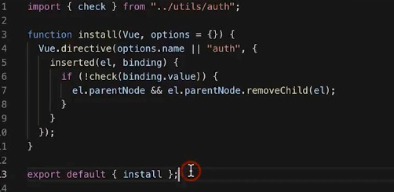

## 前言
Vue.observable( object )  
让一个对象可响应。Vue 内部会用它来处理 data 函数返回的对象。

返回的对象可以直接用于渲染函数和计算属性内，并且会在发生改变时触发相应的更新。也可以作为最小化的跨组件状态存储器，用于简单的场景：  

```
const state = Vue.observable({ count: 0 })

const Demo = {
  render(h) {
    return h('button', {
      on: { click: () => { state.count++ }}
    }, `count is: ${state.count}`)
  }
}
``` 
注意： 
在 Vue 2.x 中，被传入的对象会直接被 Vue.observable 改变，所以如这里展示的，它和被返回的对象是同一个对象。在 Vue 3.x 中，则会返回一个可响应的代理，而对源对象直接进行修改仍然是不可响应的。因此，为了向前兼容，我们推荐始终操作使用 Vue.observable 返回的对象，而不是传入源对象。

## 指令
一个指令定义对象可以提供如下几个钩子函数 (均为可选)：
bind：只调用一次，指令第一次绑定到元素时调用。在这里可以进行一次性的初始化设置。  
inserted：被绑定元素插入父节点时调用 (仅保证父节点存在，但不一定已被插入文档中)。  
update：所在组件的 VNode 更新时调用，但是可能发生在其子 VNode 更新之前。指令的值可能发生了改变，也可能没有。但是你可以通过比较更新前后的值来忽略不必要的模板更新 (详细的钩子函数参数见下)。    
componentUpdated：指令所在组件的 VNode 及其子 VNode 全部更新后调用。  
unbind：只调用一次，指令与元素解绑时调用。

```
export default {
  directives: {
    appendText: {
      bind() {
        console.log("bind");
      },
      inserted(el, binding) {
        el.appendChild(document.createTextNode(binding.value));
        console.log("inserted", el, binding);
      },
      update() {
        console.log("update");
      },
      componentUpdated(el, binding) {
        el.removeChild(el.childNodes[el.childNodes.length - 1]);
        el.appendChild(document.createTextNode(binding.value));
        console.log("componentUpdated");
      },
      unbind() {
        console.log("unbind");
      }
    }
  },
  data() {
    return {
      number: 1,
      show: true
    };
  }
};
```
## 函数式组件
在这样的场景下，我们可以将组件标记为 functional，这意味它无状态 (没有响应式数据)，也没有实例 (没有 this 上下文)。  

```
Vue.component('my-component', {
  functional: true,
  // Props 是可选的
  props: {
    // ...
  },
  // 为了弥补缺少的实例
  // 提供第二个参数作为上下文
  render: function (createElement, context) {
    // ...
  }
})
```
在 2.5.0 及以上版本中，如果你使用了单文件组件，那么基于模板的函数式组件可以这样声明：  

```
<template functional>
</template>

组件需要的一切都是通过 context 参数传递，它是一个包括如下字段的对象：
props：提供所有 prop 的对象
children: VNode 子节点的数组
slots: 一个函数，返回了包含所有插槽的对象
scopedSlots: (2.6.0+) 一个暴露传入的作用域插槽的对象。也以函数形式暴露普通插槽。
data：传递给组件的整个数据对象，作为 createElement 的第二个参数传入组件
parent：对父组件的引用
listeners: (2.3.0+) 一个包含了所有父组件为当前组件注册的事件监听器的对象。这是 data.on 的一个别名。
injections: (2.3.0+) 如果使用了 inject 选项，则该对象包含了应当被注入的属性。
```


## vue 权限控制：  
路由级别通过在路由钩子中进行控制。  
组件级别：1.指令形式。2.组件形式。  
指令形式操作dom效率不高，另外不能适应权限动态变更，也就是删除dom后不会再添加dom。提供install函数，在inserted周期中判断权限，使用的时候用插件的方式引入  
组件形式要采用函数式组件，防止影响css样式，提供效率。render函数中会传入contex参数， 有权限就返回slot中的组件。没有权限就不返回。

```
render(h,context){
   const {props,scopedSlots}=context;
   return check(props.authority)?scopedSlots.default():null;
}
```  

指令的形式   
  


