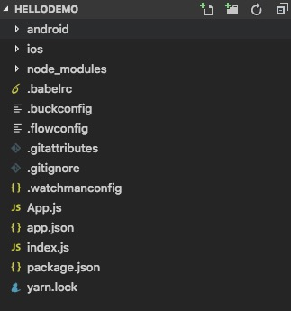

## 前言
本文主要介绍React Native的相关概念、开发环境搭建和基础的demo。
## React Native介绍
React Native 是FaceBook公司开源的一个框架。作用是使用javascript来编写原生移动应用的框架。语法与react 基本一致，RN的组件底层是原生的组件，可以与原生的组件混用，也能调用原生提供的接口和函数。目前RN的最新版本是0.59。 
## React Native开发环境搭建
React Native的开发环境搭建根据开发平台和目标平台不同有不同的配置。开发平台有 macOS、Windows和Linux 。目标平台就是 ios和Android。根据本人的实践，在macOS上搭建开发环境是最容易的，据说FB的工程师主要是用macOS来开发，所以macOS的开发环境跟友好。本文以macOS为例来讲解开发环境的搭建，其他环境的参考官网的文档：https://reactnative.cn/docs/getting-started.html。  
首先必须安装的依赖有：Node、Watchman 和 React Native 命令行工具以及 Xcode。  
在命令行中安装node和watchman。 主要node的版本必须在10以上。 Watchman则是由 Facebook 提供的监视文件系统变更的工具。

```
brew install node
brew install watchman
```
npm 可以设置国内的源：

```
npm config set registry https://registry.npm.taobao.org --global
npm config set disturl https://npm.taobao.org/dist --global
```
安装 Yarn 和 React Native 的命令行工具 

```
npm install -g yarn react-native-cli
```
设置yarn的源

```
yarn config set registry https://registry.npm.taobao.org --global
yarn config set disturl https://npm.taobao.org/dist --global
```
Xcode的安装：
React Native 目前需要Xcode 9.4 或更高版本。可以通过App Store 和 Apple开发官网（https://idmsa.apple.com/IDMSWebAuth/signin?appIdKey=891bd3417a7776362562d2197f89480a8547b108fd934911bcbea0110d07f757&path=%2Fdownload%2F&rv=1） 来安装。

## React Native 基础demo
下面我们以创建HelloWorld来讲解项目的创建：  

```
react-native init HelloDemo
你可以使用--version参数 来创建制定版本的项目，比如react-native init MyApp --version 0.44.3 ，就是指定使用0.44.3版本的RN。
```
demo 项目的目录：  
   
运行demo项目：

```
cd HelloDemo
react-native run-ios
react-native run-ios --simulator "iPhone 7 Plus" // 指定模拟器
```
修改RN代码显示 hello world:

```
index.js中的代码：

import {AppRegistry} from 'react-native';
import App from './App';
import {name as appName} from './app.json';

AppRegistry.registerComponent(appName, () => App); // 把App注册为入口
```
```
修改App.js的代码

import React, { Component } from 'react';
import { Text, View } from 'react-native';

export default class HelloWorldApp extends Component {
  render() {
    return (
        <View>
          <Text>Hello world!</Text>
        </View>
    );
  }
}
```
## 总结
本文主要讲解了React Native的功能、开发环境搭建以及HelloWorld demo项目的创建和运行方法。接下来将继续讲解基本组件的使用方法，欢迎关注。


