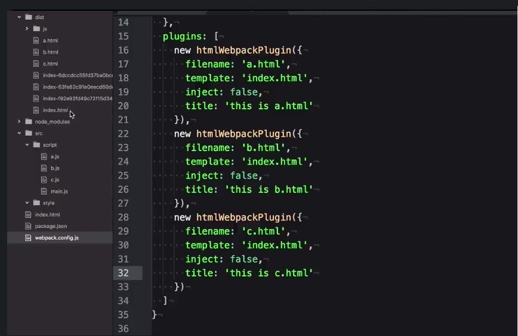
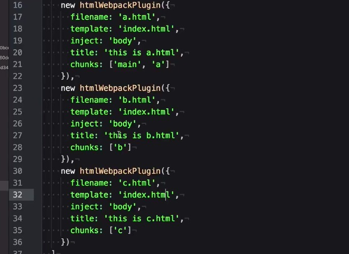
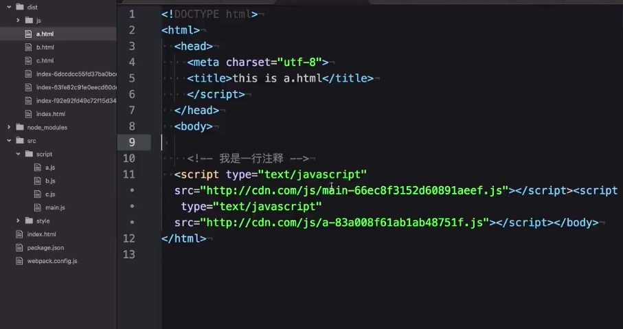

## 前言
本文将讲解webpack HtmlWebpackPlugin插件的使用方法。  
HtmlWebpackPlugin简化了HTML文件的创建，以便为你的webpack包提供服务。这对于在文件名中包含每次会随着编译而发生变化哈希的 webpack bundle 尤其有用。简单说就是可以把打包后的js自动插入到html页面中，不需要手动插入。
## 安装

```
npm install --save-dev html-webpack-plugin
```
##基本配置
只需要在plugins配置项中写入 new HtmlWebpackPlugin()即可使用该插件。
```
var HtmlWebpackPlugin = require('html-webpack-plugin');
var path = require('path');

var webpackConfig = {
  entry: 'index.js',
  output: {
    path: path.resolve(__dirname, './dist'),
    filename: 'index_bundle.js'
  },
  plugins: [new HtmlWebpackPlugin()]
};
```
生产的html如下：

```
<!DOCTYPE html>
<html>
  <head>
    <meta charset="UTF-8">
    <title>webpack App</title>
  </head>
  <body>
    <script src="index_bundle.js"></script>
  </body>
</html>
```
webpack中配置多页面应用的时候，在entry中配置多个chunk，然后在htmlWebpackPlugin中通过chunks参数来指定加载哪个chunk。在inject参数中指定把js插入到body中。


打包后的a.html如下：

## 总结
本文讲解了HtmlWebpackPlugin插件的安装、配置和使用的基本方法。HtmlWebpackPlugin是一个非常常用的webpack插件，熟练使用会带来极大地方便。
