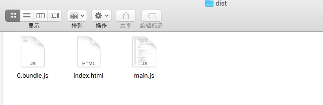
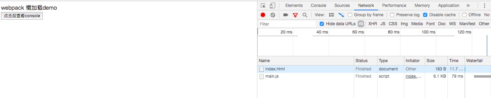
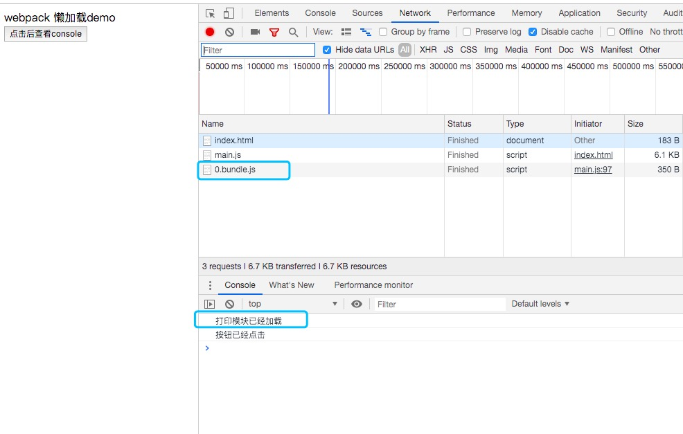

## 前言
本文主要讲解webpack的懒加载功能和vue中的懒加载实现方式。
## 懒加载基本概念
懒加载或者按需加载，是一种很好的优化网页或应用的方式。这种方式实际上是先把你的代码在一些逻辑断点处分离开，然后在一些代码块中完成某些操作后，立即引用或即将引用另外一些新的代码块。这样加快了应用的初始加载速度，减轻了它的总体体积，因为某些代码块可能永远不会被加载。  
webpack 中实现懒加载主要是用import,另一种是使用webpack特定的require.ensure。
## 懒加载的demo
我们实现一个这样的功能，在页面上增加一个按钮，当点击这个按钮的时候动态加载一个打包好的js文件。  
我们要懒加载的js文件是print.js

```
console.log('打印模块已经加载');
export default () => {
  console.log('按钮已经点击');
}
```
main.js的内容主要是显示按钮和懒加载print.js：

```

function component() {
  var element = document.createElement('div');
  var button = document.createElement('button');
  var br = document.createElement('br');
  button.innerHTML = '点击后查看console';
  element.innerHTML = 'webpack 懒加载demo';
  element.appendChild(br);
  element.appendChild(button);
  button.onclick = e => import(/* webpackChunkName: "print" */ './print').then(module => {
    var print = module.default;
    print();
  }); 
  return element;
}
document.body.appendChild(component());
```
其中  e => import(/* webpackChunkName: "print" */ './print') 就是懒加载的代码，返回的是promise。
webpack.config.js如下：  

```
const HTMLWebpackPlugin = require('html-webpack-plugin');
 module.exports = {
     entry: {
         main: process.cwd()+'/code/main.js',        
     },
     output: {
       path: process.cwd() + '/dist',
       chunkFilename: '[name].bundle.js',
       filename: '[name].js'
     },
     plugins: [
         new HTMLWebpackPlugin({
           title: 'Code Splitting'
         }),         
     ]
 };


```
打包后的dist目录：
  
页面效果：  
  
我们从network中可以看到 目前只加载了两个文件 ：index.html和 main.js。  
然后我们打开console，点击按钮：
 
可以看到console中已经打出了“打印模块已经加载”，同时查看network发现已经加载了0.bundle.js文件，说明这个就是点击后加载的模块。这样我们就实现了懒加载功能。  
demo地址：https://github.com/kobefaith/fullStackWay/tree/master/09-Webpack基础/lazyload_demo  
## vue中的懒加载
以上我们讲解的是原生js中的懒加载实现，如果在vue中可以这样实现：  

```
Vue.component("AsyncCmp", () => import("./AsyncCmp"));
```
vue router中可以这样：

```
const Login = () => import("./login");

new VueRouter({
  routes: [{ path: "/login", component: Login }]
});
```
## 总结
本文主要讲解了webpack懒加载的实现方式和vue中懒加载的实现方式，并给出了demo的代码。


