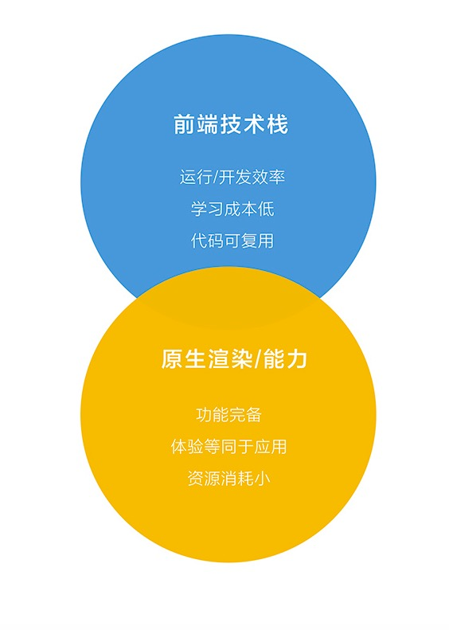
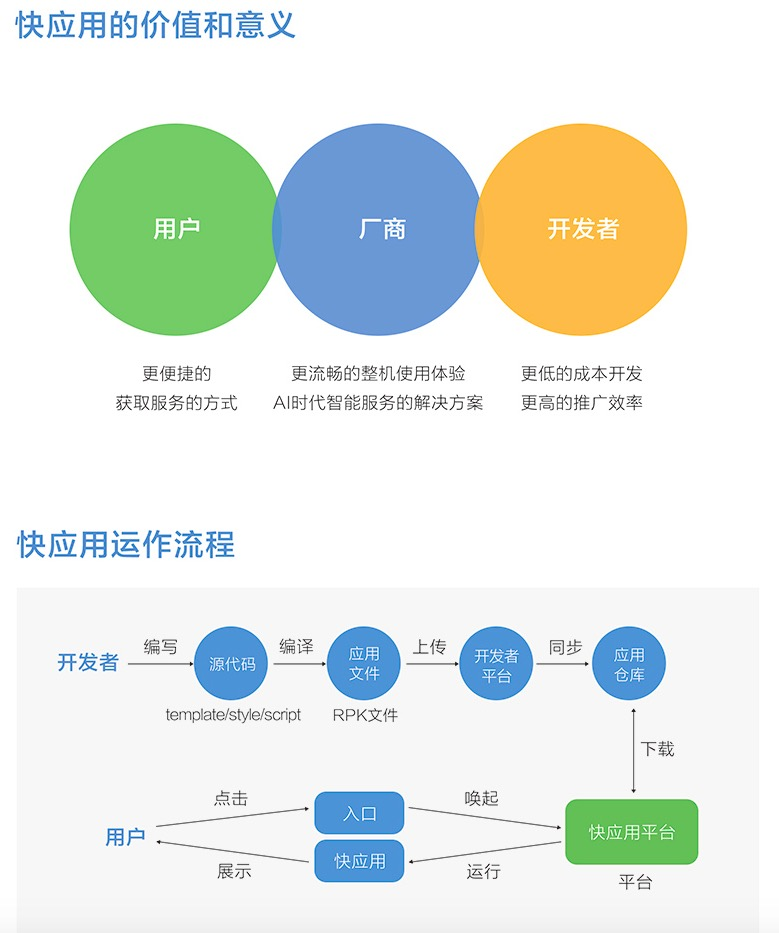
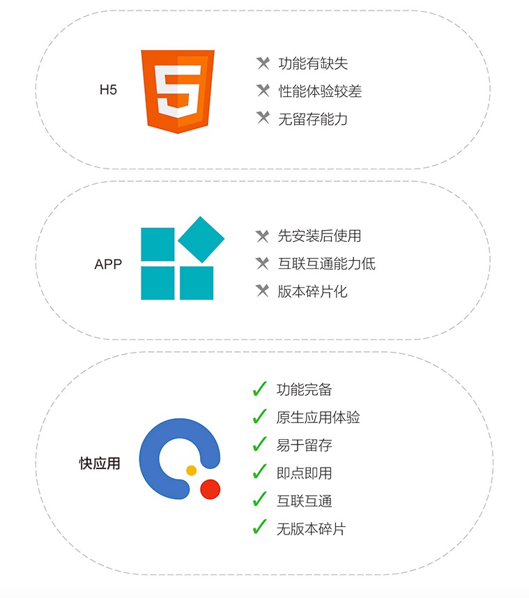
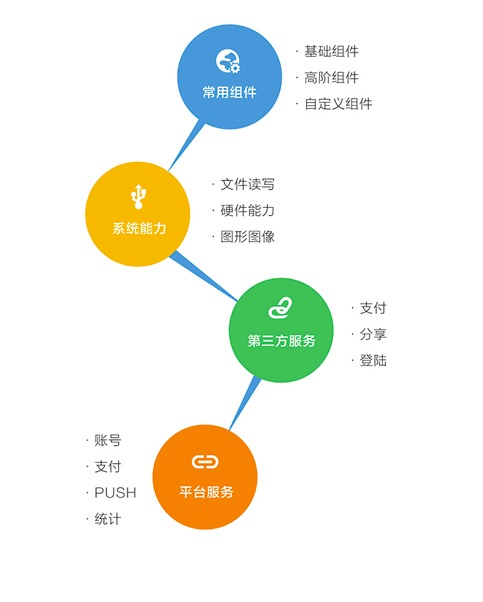

##前言
本文主要介绍快应用开发相关的知识。
## 快应用介绍
[官方文档](https://www.quickapp.cn)  
快应用 （Quick App）是基于手机硬件平台的新型应用形态；  
标准是由主流手机厂商组成的快应用联盟联合制定；  
快应用标准的诞生将在研发接口、能力接入、开发者服务等层面建设标准平台；以平台化的生态模式对个人开发者和企业开发者全品类开放。  
个人理解：安卓端原生系统支持的小程序，主要是为了对抗微信小程序。  
##快应用的特点：


性能优势： 


接口能力：  

##HelloWorld 
###开发环境搭建
一种方法是IDE环境搭建，主要是安装快应用开发者工具。[文档](https://doc.quickapp.cn/tutorial/ide/)
另一种方法是命令行方式：

```
node 6.0以上，建议10.0+
npm install -g hap-toolkit
hap -v // 如果安装成功 会输出版本信息。
在安卓手机上安装调试器APK，然后通过扫码来调试程序。

```

```
hap init testApp  //初始化代码
```

```
npm install
npm run build
编译打包成功后，项目根目录下会生成文件夹：build、dist
build：临时产出，包含编译后的页面 js，图片等
dist：最终产出，包含 rpk 文件。其实是将 build 目录下的资源打包压缩为一个文件，后缀名为rpk，这个rpk文件就是项目编译后的最终产出
```
### 调试
调试分为 WIFI调试和USB调试。
[文档](https://doc.quickapp.cn/tutorial/getting-started/development-and-debugging.html)
##框架
###生命周期

```
页面的生命周期：onInit(表示ViewModel的数据已经准备好，可以开始使用页面中的数据)、onReady (表示ViewModel的模板已经编译完成，可以开始获取 DOM 节点（如：this.$element(idxxx)）)、onShow、onHide、onDestroy、onBackPress、onMenuPress
页面的状态：显示、隐藏、销毁
APP 的生命周期：onCreate、onDestroy
```
###页面样式与布局
框架使用 border-box 模型 ，也就是宽度和高度是包含 border 和 padding的，跟我们平时web默认的content-box 不同。  
长度单位是px 和%，此处的px相当于rem。

```
项目配置基准宽度设置
<ProjectName>/src/manifest.json 
{
  "config": {
    "designWidth": 640
  }
}
```
### Flex布局

```
<template>
  <div class="tutorial-page">
    <div class="item">
      <text>item1</text>
    </div>
    <div class="item">
      <text>item2</text>
    </div>
  </div>
</template>

<style>
  .tutorial-page {
    /* 交叉轴居中 */
    align-items: center;
    /* 纵向排列 */
    flex-direction: column;
  }
  .tutorial-page > .item {
    /* 有剩余空间时，允许被拉伸 */
    /*flex-grow: 1;*/
    /* 空间不够用时，不允许被压缩 */
    flex-shrink: 0;
    /* 主轴居中 */
    justify-content: center;
    width: 200px;
    height: 100px;
    margin: 10px;
    background-color: #FF0000;
  }
</style>
```
###动态修改样式

```
修改 class ：更新组件的 class 属性中使用的变量的值
修改内联 style ：更新组件的 style 属性中的某个 CSS 的值
修改绑定的对象：通过绑定的对象控制元素的样式 1030+
修改绑定的样式字符串：通过样式字符串控制元素的样式 1030+
<template>
  <div style="flex-direction: column;">
    <!-- 修改 class -->
    <text class="normal-text {{ className }}" onclick="changeClassName">点击我修改文字颜色</text>
    <!-- 修改内联 style -->
    <text style="color: {{ textColor }}" onclick="changeInlineStyle">点击我修改文字颜色</text>
    <!-- 修改绑定的对象 (1030+) -->
    <text style="{{ styleObj }}" onclick="changeStyleObj">点击我修改文字颜色</text>
    <!-- 修改绑定的样式字符串 (1030+) -->
    <text style="{{ styleText }}" onclick="changeStyleText">点击我修改文字颜色</text>
  </div>
</template>

<style>
  .normal-text {
    font-weight: bold;
  }
  .text-blue {
    color: #0faeff;
  }
  .text-red {
    color: #f76160;
  }
</style>

<script>
  export default {
    private: {
      className: 'text-blue',
      textColor: '#0faeff',
      styleObj: {
        color: 'red'
      },
      styleText: 'color: blue'
    },
    onInit () {
      this.$page.setTitleBar({ text: '动态修改样式' })
    },
    changeClassName () {
      this.className = 'text-red'
    },
    changeInlineStyle () {
      this.textColor = '#f76160'
    },
    changeStyleObj () {
      this.styleObj = {
        color: 'yellow'
      }
    },
    changeStyleText () {
      this.styleText = 'color: green'
    }
  }
</script>
```
###框架指令
for 指令 

```
<template>
  <div class="tutorial-page">
    <!-- 方式1：默认$item代表数组中的元素, $idx代表数组中的索引 -->
    <div class="tutorial-row" for="{{list}}">
      <text>{{$idx}}.{{$item.name}}</text>
    </div>
    <!-- 方式2：自定义元素变量名称 -->
    <div class="tutorial-row" for="value in list">
      <text>{{$idx}}.{{value.name}}</text>
    </div>
    <!-- 方式3：自定义元素、索引的变量名称 -->
    <div class="tutorial-row" for="(personIndex, personItem) in list">
      <text>{{personIndex}}.{{personItem.name}}</text>
    </div>
  </div>
</template>

<style lang="less">
  .tutorial-page {
    flex-direction: column;
    .tutorial-row {
      width: 85%;
      margin-top: 10px;
      margin-bottom: 10px;
    }
  }
</style>

<script>
  export default {
    private: {
      list: [
        {name: 'aa'},
        { name: 'bb' }
      ]
    },
    onInit () {
      this.$page.setTitleBar({ text: '指令for' })
    }
  }
</script>
```
if指令

```
<template>
  <div class="tutorial-page">
    <text onclick="onClickShow">显示隐藏：</text>
    <text show="{{showVar}}">show: 渲染但控制是否显示</text>

    <text onclick="onClickCondition">条件指令：</text>
    <text if="{{conditionVar === 1}}">if: if条件</text>
    <text elif="{{conditionVar === 2}}">elif: elif条件</text>
    <text else>else: 其余</text>
  </div>
</template>

<style lang="less">
  .tutorial-page {
    flex-direction: column;
  }
</style>

<script>
  export default {
    private: {
      showVar: true,
      conditionVar: 1
    },
    onInit () {
      this.$page.setTitleBar({ text: '指令if与指令show' })
    },
    onClickShow () {
      this.showVar = !this.showVar
    },
    onClickCondition () {
      this.conditionVar = ++this.conditionVar % 3
    }
  }
</script>
```
[组件 block 和 组件 slot](https://doc.quickapp.cn/tutorial/framework/framework-instructions.html)
##页面切换

```
通过组件 a 切换页面和传递参数
通过接口 router 切换页面和传递参数
接收参数
回传参数

```

```
<a href="/PageParams/receiveparams">跳转到接收参数页面</a>
<a href="tel:10086">调起电话</a>
<a href="/PageParams/receiveparams?key=Hello, world!">携带参数key1跳转</a>
<a href="/PageParams/receiveparams?key={{title}}">携带参数key2跳转</a>
```

```
<template>
  <div class="tutorial-page">
    <input class="btn" type="button" value="跳转到接收参数页面" onclick="routePagePush"></input>
    <input class="btn" type="button" value="跳转到接收参数页面，当前页面无法返回" onclick="routePageReplace"></input>
    <input class="btn" type="button" value="返回上一页" onclick="routePageBack"></input>
    <input class="btn" type="button" value="清空页面记录，仅保留当前页面" onclick="routePageClear"></input>
  </div>
</template>

<style>
  .tutorial-page {
    flex-direction: column;
    justify-content: center;
    align-items: center;
  }
  .btn {
    width: 550px;
    height: 86px;
    margin-top: 75px;
    border-radius: 43px;
    background-color: #09ba07;
    font-size: 30px;
    color: #ffffff;
  }
</style>

<script>
  // 导入模块
  import router from '@system.router'

  export default {
    onInit () {
      this.$page.setTitleBar({ text: '接口router切换页面' })
    },
    routePagePush () {
      // 跳转到应用内的某个页面
      router.push({
        uri: '/PageParams/receiveparams'
      })
    },
    routePageReplace () {
      // 跳转到应用内的某个页面，当前页面无法返回
      router.replace({
        uri: '/PageParams/receiveparams'
      })
    },
    routePageBack () {
      // 返回上一页面
      router.back()
    },
    routePageClear () {
      // 清空所有历史页面记录，仅保留当前页面
      router.clear()
    }
  }
</script>
```
router 接口的参数 params 可配置页面跳转时需要传递的参数

```
<template>
  <div class="tutorial-page">
    <input class="btn" type="button" value="携带参数跳转页面" onclick="routePagePushWithParams"></input>
    <input class="btn" type="button" value="携带参数跳转页面，当前页面无法返回" onclick="routePageReplaceWithParams"></input>
  </div>
</template>

<style>
  .tutorial-page {
    flex-direction: column;
    justify-content: center;
    align-items: center;
  }
  .btn {
    width: 550px;
    height: 86px;
    margin-top: 75px;
    border-radius: 43px;
    background-color: #09ba07;
    font-size: 30px;
    color: #ffffff;
  }
</style>

<script>
  // 导入模块
  import router from '@system.router'

  export default {
    private: {
      title: 'Hello, world!'
    },
    onInit () {
      this.$page.setTitleBar({ text: '接口router切换页面并传递参数' })
    },
    routePagePushWithParams () {
      // 跳转到应用内的某个页面
      router.push({
        uri: '/PageParams/receiveparams',
        params: { key: this.title }
      })
    },
    routePageReplaceWithParams () {
      // 跳转到应用内的某个页面，当前页面无法返回
      router.replace({
        uri: '/PageParams/receiveparams',
        params: { key: this.title }
      })
    }
  }
</script>

```
接收参数 ：组件 a 和接口 router 传递的参数的接收方法完全一致：在页面的 ViewModel 的protected属性中声明使用的属性（protected 内定义的属性，允许被应用内部页面请求传递的数据覆盖，不允许被应用外部请求传递的数据覆盖）。
<template>
  <div class="tutorial-page">
    <text>page</text>
    <!-- template中显示页面传递的参数 -->
    <text>{{key}}</text>
  </div>
</template>

<style>
  .tutorial-page {
    flex-direction: column;
    justify-content: center;
    align-items: center;
  }
</style>

<script>
  export default {
    protected: {
      key: ''
    },
    onInit () {
      this.$page.setTitleBar({ text: '接收参数' })

      // js中输出页面传递的参数
      console.info('key: ' + this.key)
    }
  }
</script>
```
<template>
  <div class="tutorial-page">
    <text>page</text>
    <!-- template中显示页面传递的参数 -->
    <text>{{key}}</text>
  </div>
</template>

<style>
  .tutorial-page {
    flex-direction: column;
    justify-content: center;
    align-items: center;
  }
</style>

<script>
  export default {
    protected: {
      key: ''
    },
    onInit () {
      this.$page.setTitleBar({ text: '接收参数' })

      // js中输出页面传递的参数
      console.info('key: ' + this.key)
    }
  }
</script>
```
##事件监听与触发

```
监听与移除监听事件：$on()、$off
触发ViewModel事件：$emit()
监听原生组件事件
触发原生组件事件：$emitElement()
```
```
export default {
  onInit() {
    this.$on('customEvtType1', this.customEvtType1Handler)
  },
  customEvtType1Handler(evt) {
    // 事件类型，事件参数
    console.info(
      `触发事件：类型：${evt.type}, 参数： ${JSON.stringify(evt.detail)}`
    )
  }
}

this.$off('customEvtType1')
    // 传递fnHandler：移除指定的监听函数
this.$off('customEvtType1',this.customEvtType1Handler)
触发事件：
export default {
  emitEvent() {
    this.$emit('customEvtType1', { params: '参数内容' })
  }
}
监听原生组件事件：
<template>
  <div class="tutorial-page">
    <text id="elNode1" class="{{ elClassName + 1 }}" disabled="false" onclick="onClickHandler">组件节点1</text>
    <text id="elNode2" class="class-static-1 {{ elClassName + 2 }}" onclick="onClickHandler2('参数1', argName)">组件节点2</text>
  </div>
</template>

<style lang="less">
  .tutorial-page {
    flex-direction: column;
  }
</style>

<script>
  export default {
    private: {
      elClassName: 'class-dynamic',
      argName: '动态参数'
    },
    onClickHandler (evt) {
      // 事件类型，参数详情
      console.info(`触发事件：类型：${evt.type}, 详情： ${JSON.stringify(evt.detail)}`);

      if (evt.target) {
        console.info(`触发事件：节点：${evt.target.id}, ${evt.target.attr.disabled}`)
      }
    },
    onClickHandler2 (arg1, arg2, evt) {
      // 事件类型，事件参数，target
      console.info(`触发事件：类型：${evt.type}, 参数： ${arg1}, ${arg2}`);
    }
  }
</script>
```
## 自定义组件
```
自定义组件比页面组件的不同之处在于多了一个props属性，用于声明该组件可接受的外部数据传递；props是一个数组，数组中每个元素是暴露的属性名称
<template>
  <div class="tutorial-page">
    <text class="tutorial-title">自定义组件:</text>
    <text>{{ prop1 }}</text>
    <text>{{ prop2Object.name }}</text>
  </div>
</template>

<style lang="less">
  .tutorial-page {
    flex-direction: column;
    padding-top: 20px;

    .tutorial-title {
      font-weight: bold;
    }
  }
</style>

<script>
  // 子组件
  export default {
    props: [
      'prop1',
      'prop2Object'
    ],
    data: {},
    onInit () {
      console.info(`外部传递的数据：`, this.prop1, this.prop2Object)
    }
  }
</script>
组件引用 
<import name="comp-part1" src="./part1"></import>
<import>标签中的的src属性指定自定义组件的地址，name属性指定在<template>组件中引用该组件时使用的标签名称
```
组件之间通信：

```
父组件传递的数据本身就是对象，子组件直接修改的就是这个对象中的属性；那么父组件同样也就拿到了最终数据
子组件在data中保存了一份内部数据，需要交给父组件：子组件通过$dispatch()完成事件触发，父组件通过$on()绑定事件并响应，如：evtType2；
子组件在data中保存了一份内部数据，需要交给父组件：子组件通过$emit()触发在节点上绑定的事件来执行父组件的方法，如：evtType3；
<script>
  // 子组件
  export default {
    props: [
      'prop1',
      'prop2Object'
    ],
    data () {
      return {
        upperProp1: this.prop1
      }
    },
    onInit () {
      console.info(`外部传递的数据：`, this.prop1, this.prop2Object)
      // 绑定VM的自定义事件
      this.$on('evtType1', this.evtTypeHandler)
      this.$on('evtType2', this.evtTypeHandler)
    },
    evtTypeHandler (evt) {
      console.info(`子组件：事件响应: `, evt.type, evt.detail)
      // 结束事件传递
      // evt.stop()
    },
    evtType2Emit () {
      this.$dispatch('evtType2', { params: '额外参数' })
    },
    evtType3Emit () {
      this.$emit('evtType3', { params: '额外参数' })
    }
  }
</script>
向下传递：父组件触发，子组件响应；调用parentVm.$broadcast()完成向下传递，如：evtType1
向上传递：子组件触发，父组件响应；调用childVm.$dispath()完成向上传递，如：evtType2
```
##总结
本文主要介绍了快应用的概念，特点，环境搭建以及给出了一些开发中常见问题的实例代码。
